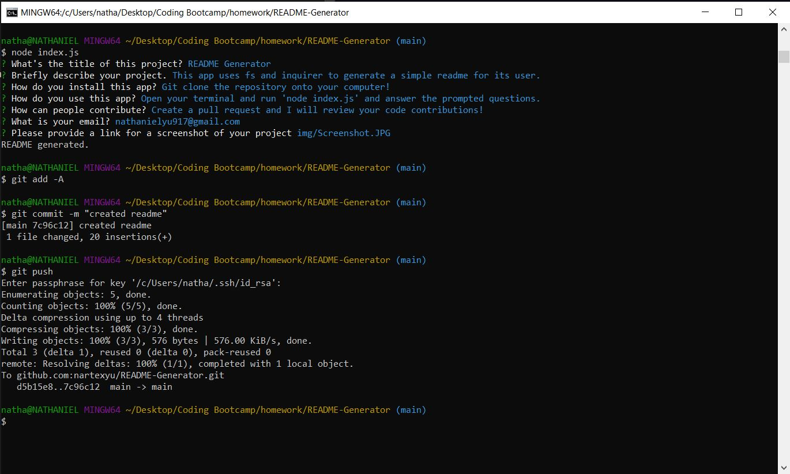

# README Generator

## Description
This app uses fs and inquirer to generate a simple readme for its user.

## Installation
Git clone the repository onto your computer!

## Usage
Open your terminal and run 'node index.js' and answer the prompted questions.

## Contributing
Create a pull request and I will review your code contributions!

## Contact me
Feel free to contact me if you have any questions at nathanielyu917@gmail.com!

## Screenshot

    
